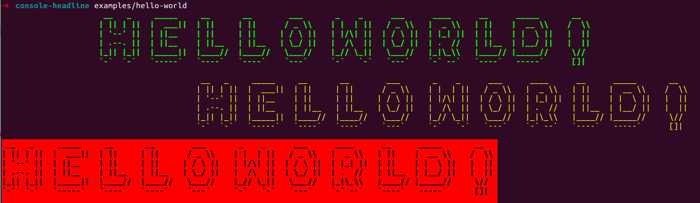

# Console Headline
Helper to create FIGlet headlines with Symfony Console and Laminas Text.



## Try examples

```bash
$ git clone git@github.com:chr-hertel/console-headline.git
$ cd console-headline
$ composer install
$ example/hello-world
```

## Usage

```bash
$ composer require stoffel/console-headline
```

Usage in PHP

```php
use Stoffel\Console\Headline\HeadlineHelper;

HeadlineHelper::create($output)
    ->setText('Hello World!')
    ->setColor(new Color('#00FF00', '', ['bold']))
    ->setFigletOptions([
        'font' => '/path/to/font.flf',
    ])
    ->write();
```
